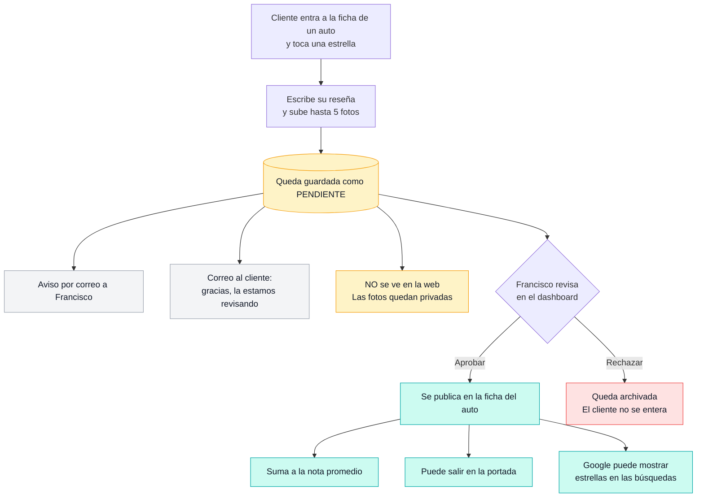
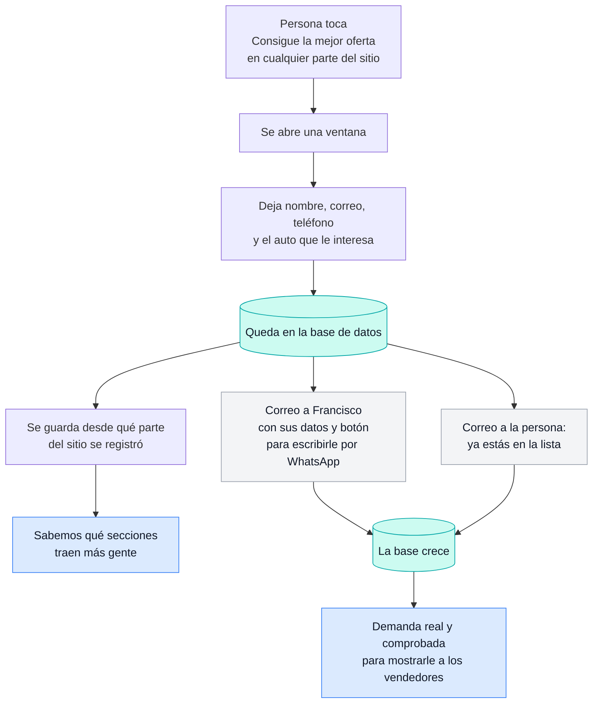
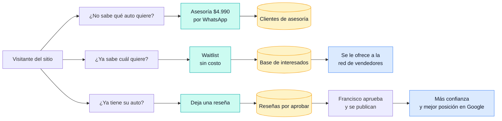

# Cómo funcionan los dos flujos nuevos

> Explicación simple, sin tecnicismos. Septiembre 2026.
> Los diagramas están en formato Mermaid: se ven dibujados en GitHub, Notion y la mayoría
> de las herramientas. Si los ves como texto, pégalos en https://mermaid.live

---

# 1. Flujo de RESEÑAS

Un cliente cuenta su experiencia con su auto. **Nada se publica sin que tú lo apruebes.**

### Lo importante

- **Nada se publica solo.** Todo pasa por tu revisión, una por una.
- Se muestra **"Juan P."**, nunca el apellido completo ni el correo ni el teléfono.
- Las fotos sin revisar **no son accesibles** ni con el link directo.
- Las reseñas van **solo en la ficha de cada auto**, no en los listados — así un comentario
  malo no arrastra la imagen de todo el catálogo.
- Queda registrado **quién** aprobó cada reseña (útil cuando haya más gente ayudando).

### Ideas para más adelante

- **Invitar a reseñar solo a quien compró**, con un link personal. Hoy cualquiera puede
  escribir, pero como tú apruebas todo, nada malo llega a publicarse.
- **Pedir la reseña por WhatsApp** después de la compra — es el momento de mayor respuesta.
- **Videos** tipo TikTok (en pausa por ahora).

---

# 2. Flujo de WAITLIST (lista de espera)

Alguien interesado en conseguir una buena oferta deja sus datos.

### Lo importante

- Registrarse **no compromete a nada** y **no promete** una oferta.
- Hay una vista que muestra **una sola fila por persona**, aunque se registre dos veces.
- Sabemos **qué parte del sitio trae más gente** — sirve para decidir dónde invertir.

### Ideas para más adelante

- **Avisarles por WhatsApp**, no solo por correo (se lee mucho más).
- **Agrupar por modelo**: "23 personas esperan un BYD Dolphin" es justo el argumento
  de venta para un vendedor.
- **Recordatorio automático** a las semanas, para que no se enfríe el interés.

---

# Los dos flujos juntos

Cómo se conectan con el resto del negocio hoy:

