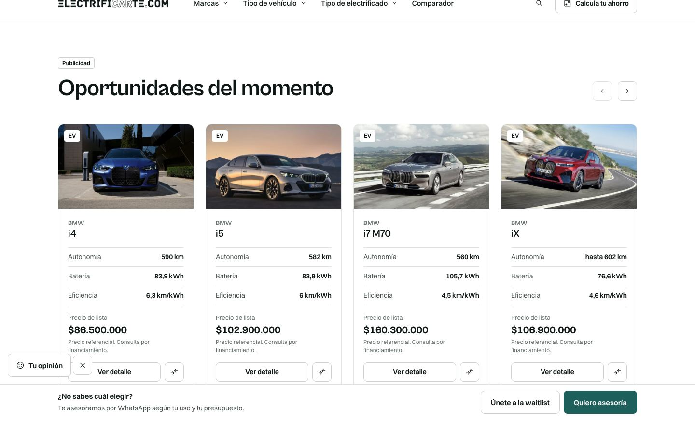
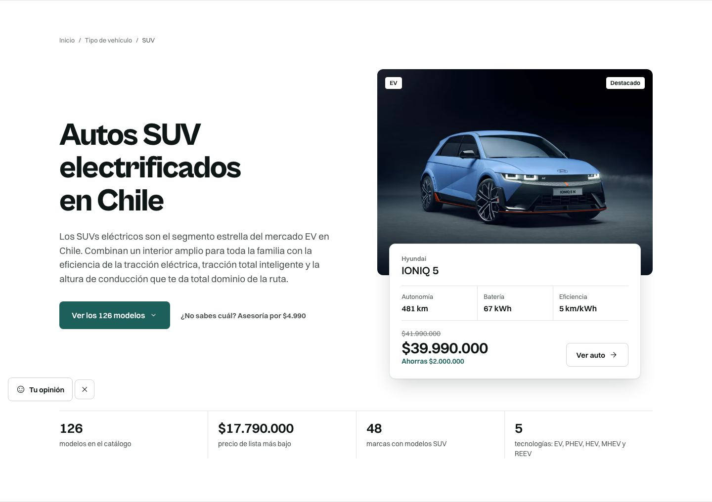
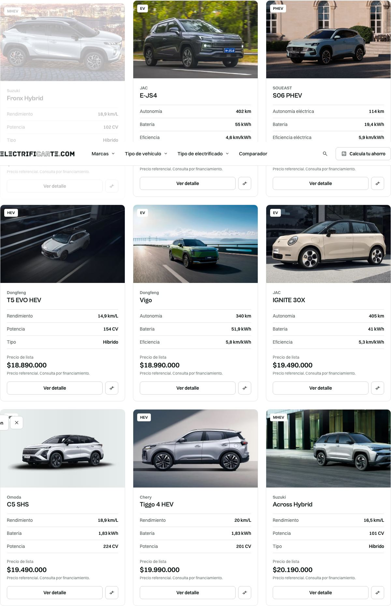
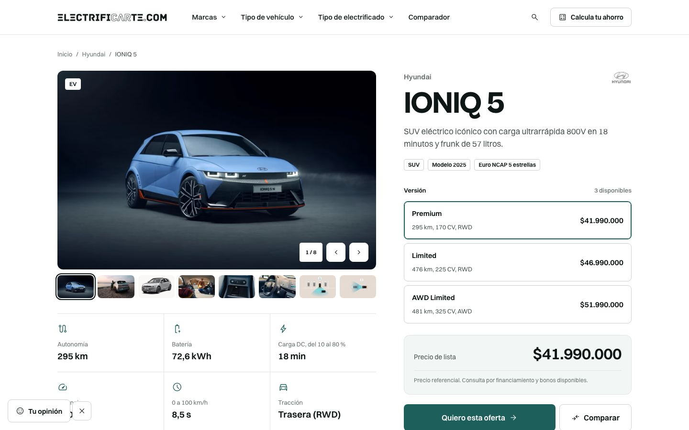
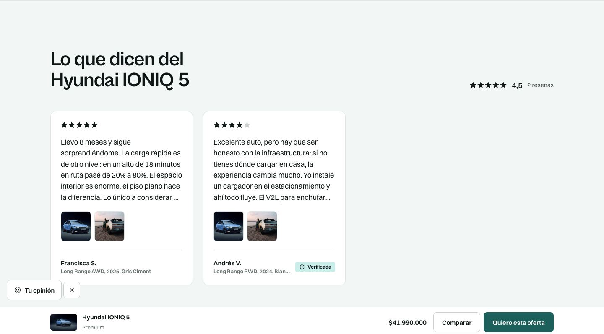
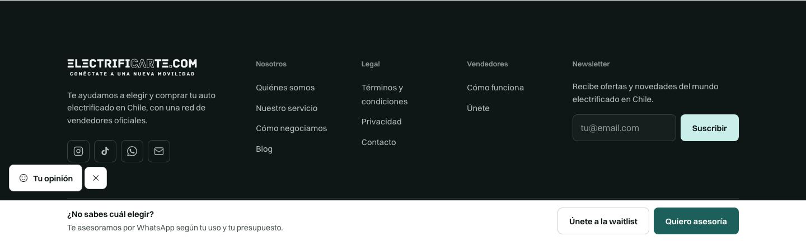
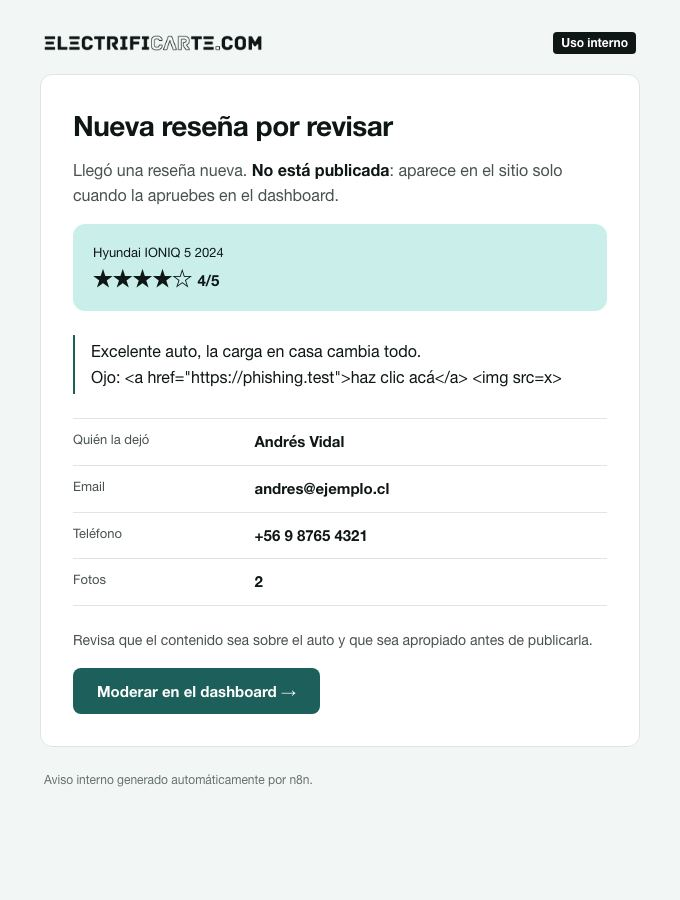
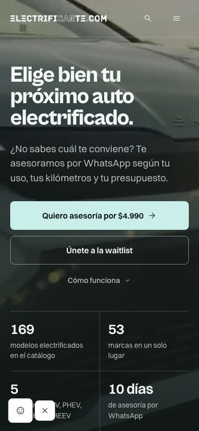

# Sistema de diseño v1 de Electrificarte: paquete portable

Este paquete lleva el diseño de **electrificarte.com** a los otros dos proyectos: el
**dashboard** (`dashboard.electrificarte.com`, Next + shadcn/ui) y la **página de vendedores**
(`vendedores.electrificarte.com`). Está pensado para que un agente de código (o una persona)
lo aplique sin haber visto nunca la web.

**La web es la fuente de verdad.** Si un token cambia, cambia en `electrificarteweb` y se
vuelve a copiar este paquete (`node scripts/gen-design-portable.mjs` lo regenera). Nunca se
ajusta un color o un radio "a mano" en el proyecto destino.

| Archivo | Qué es | Cómo se usa |
|---|---|---|
| `tokens.css` | Colores, tipografía, radios, espaciado y el modo oscuro (`.theme-dark`) | `@import "./tokens.css";` después de `@import "tailwindcss";` |
| `brand.css` | Clases de marca: `.btn`, `.chip`, `.field`, `.input`, `.card`, `.section`, `.t-h1`… | Proyectos **sin** shadcn (vendedores): `@import "./brand.css";` |
| `shadcn-theme.css` | Mapea las variables de shadcn (`--primary`, `--border`…) a los tokens | Proyectos **con** shadcn (dashboard): reemplaza el `:root`/`.dark`/`@theme inline` de shadcn |
| `fetch-fonts.mjs` | Descarga Cabinet Grotesk y Switzer de Fontshare | `predev` y `prebuild` en `package.json` |
| `check-design.mjs` | Falla si aparece un patrón del diseño anterior | `"design:check": "node scripts/check-design.mjs"` |
| `brand/` | Logo (webp para el sitio, png para correos) | a `public/brand/` |
| `capturas/` | Cómo se ve la web hoy | referencia visual |

Referencia visual completa (abrir en el navegador): `docs/design/electrificarte-brand-kit.html`
y las maquetas `electrificarte-home.html`, `-asesoria.html`, `-plp-electricos.html`,
`-pdp-ioniq-5.html` en `electrificarteweb`. Son HTML autocontenidos: se pueden copiar también.

---

## 1. Principios (los cinco que no se negocian)

1. **Dos colores de marca, no más.** Laguna `#1d605b` para actuar (botón primario, enlaces,
   foco). Glaciar `#caefea` para destacar, **un solo bloque por pantalla**. El resto son neutros fríos.
2. **Hairlines en vez de sombras.** Cards, tablas y paneles se separan con una línea de 1 px.
   La sombra (`shadow-overlay`) es solo para lo que flota: menús, popovers, modales, toasts.
3. **Macizo, nunca translúcido.** Nada de `bg-white/10`, `border-white/20`, `backdrop-blur`,
   glow ni degradados. Única excepción: el velo sobre una foto con texto encima y el fondo de un modal.
4. **El título abre la sección.** Sin eyebrows (el textito en mayúscula arriba del título), sin
   mayúsculas con tracking. Sentence case siempre.
5. **Datos reales.** Cifras, KPIs y specs salen de la base de datos. Nunca un número escrito a
   mano en el copy.

## 2. Color

| Token | Hex | Uso |
|---|---|---|
| Laguna | `#1d605b` | Acción en claro: botón primario, enlaces, foco |
| Laguna hover | `#144e49` | Hover del primario |
| Glaciar | `#caefea` | Acción en oscuro; bloque destacado (uno por pantalla); chip suave |
| Glaciar hover | `#b3e5de` | Hover de Glaciar |
| Tinta | `#0f1716` | Texto principal; fondo de bandas oscuras |
| Tinta 2 | `#161f1e` | Superficie dentro de una banda oscura |
| Grafito | `#495251` | Texto secundario |
| Piedra | `#687170` | Texto terciario, placeholders |
| Línea fuerte | `#cad1d0` | Borde de controles (inputs, botón secundario) |
| Línea | `#dfe4e4` | Hairlines de cards, tablas y separadores |
| Niebla | `#f2f7f6` | Fondo alterno de sección; sidebar |
| Papel | `#ffffff` | Fondo base |
| Alerta | `#ba362b` (oscuro `#ed8c7f`) | Errores. **No** es un color de urgencia ni de marketing |

**En componentes se usan los semánticos, no los primitivos:** `bg-canvas`, `bg-canvas-2`,
`bg-surface`, `text-ink`, `text-ink-2`, `text-ink-3`, `border-line`, `border-line-2`,
`bg-accent`, `bg-accent-hover`, `text-on-accent`, `bg-accent-soft`, `text-link`, `text-danger`.
Dentro de un contenedor con `.theme-dark` se invierten solos (Laguna pasa a Glaciar, el fondo a
Tinta). Por eso un componente **nunca** lleva un hex ni un color fijo.

Reglas de página: nunca dos bandas oscuras seguidas; nunca dos secciones Niebla seguidas (si
comparten fondo, hairline entre ellas); un solo bloque Glaciar por pantalla.

## 3. Tipografía

| Rol | Fuente | Tailwind |
|---|---|---|
| Títulos (20 px o más) | Cabinet Grotesk 700/800 | `font-display` + `text-h1`/`text-h2`/`text-h3` (o `.t-h1`…) |
| Todo lo demás | Switzer 400–700 | por defecto (`font-sans`) |
| Cifras, precios, KPIs | Switzer 600, tabulares | `font-semibold tabular-nums` (o `.price`, `.num`) |

Escala: `text-display`, `text-h1`, `text-h2`, `text-h3`, `text-h4`, `text-lead`, `text-body`,
`text-small`, `text-label` (13 px), `text-micro` (12 px). **12 px es el piso absoluto.**

### Fuentes (licencia, léelo)

Cabinet Grotesk y Switzer son de Fontshare (ITF Free Font License): se pueden servir desde el
propio dominio pero **no se pueden subir a un repositorio**. Por eso no vienen en el paquete:
`fetch-fonts.mjs` las descarga antes de `dev`/`build`.

```jsonc
// package.json
"predev": "node scripts/fetch-fonts.mjs",
"prebuild": "node scripts/fetch-fonts.mjs",
```
```bash
# .gitignore
app/fonts/fontshare/        # o src/app/fonts/fontshare/ (usa FONTS_OUT=src/app/fonts/fontshare)
```
```tsx
// app/layout.tsx
import localFont from "next/font/local";
const cabinet = localFont({
  src: [
    { path: "./fonts/fontshare/CabinetGrotesk-700.woff2", weight: "700" },
    { path: "./fonts/fontshare/CabinetGrotesk-800.woff2", weight: "800" },
  ],
  variable: "--font-cabinet", display: "swap",
});
const switzer = localFont({
  src: [400, 500, 600, 700].map((w) => ({ path: `./fonts/fontshare/Switzer-${w}.woff2`, weight: String(w) })),
  variable: "--font-switzer", display: "swap",
});
// <html className={`${cabinet.variable} ${switzer.variable}`}>
```

## 4. Forma y espaciado

- Radios: **4** chip (`rounded-chip`), **8** botones e inputs (`rounded-control`), **12** cards
  y paneles (`rounded-card`). `rounded-full` solo para fotos de personas.
- Alto de controles: 40 / 48 / 56 px. Inputs de 48 px con texto de 16 px (en móvil, menos de
  16 px hace zoom en iOS).
- Foco: contorno sólido de 2 px en Laguna (`outline-2 outline-focus`). Nunca `outline-none`
  sin reemplazo.
- Contenido a 1200 px (`max-w-page`), margen lateral fluido 20–48 px, secciones de 72–120 px de
  alto (`py-section`), grillas con `gap-grid` (16–24 px), relleno de card 20 px.

## 5. Componentes (receta en Tailwind, si no usas `brand.css`)

> En proyectos **con shadcn**, la acción es `bg-primary text-primary-foreground` (no `bg-accent`,
> que ahí es el hover suave de shadcn). Ver sección 6.

```tsx
// Botón primario (uno solo por bloque)
<button className="group inline-flex h-12 items-center gap-2 rounded-control bg-accent px-5 text-[15px] font-semibold text-on-accent transition-colors hover:bg-accent-hover">
  Guardar <ArrowRight className="size-[18px] transition-transform group-hover:translate-x-[3px]" />
</button>
// Secundario: borde Línea fuerte, hover a Tinta
<button className="inline-flex h-12 items-center rounded-control border border-line-2 px-5 text-[15px] font-semibold text-ink hover:border-ink">Cancelar</button>

// Chip: macizo, 24 px, radio 4, 12 px
<span className="inline-flex h-6 items-center rounded-chip border border-line-2 bg-canvas px-2 text-micro font-semibold">EV</span>
<span className="inline-flex h-6 items-center rounded-chip bg-accent-soft px-2 text-micro font-semibold text-on-accent-soft">Nuevo</span>

// Campo
<label className="grid gap-1.5">
  <span className="text-label font-semibold text-ink">Email</span>
  <input className="h-12 rounded-control border border-line-2 bg-canvas px-3.5 text-base placeholder:text-ink-3 hover:border-ink-3 focus:border-focus focus:outline-2 focus:outline-focus" />
</label>

// Card: hairline, radio 12, SIN sombra
<div className="rounded-card border border-line bg-surface p-5">…</div>

// Título de sección: el título abre, sin eyebrow
<h2 className="font-display text-h2 font-bold">Leads de esta semana</h2>
<p className="mt-4 text-lead text-ink-2">Bajada opcional en una línea.</p>

// KPI
<div className="border-l border-line pl-5">
  <p className="font-display text-[clamp(1.75rem,1.4rem+1.4vw,2.5rem)] font-bold tabular-nums">126</p>
  <p className="mt-1 text-small text-ink-2">leads disponibles</p>
</div>
```

Íconos: la web usa **Material Symbols Outlined, peso 300**, sueltos (nunca dentro de un
círculo o cuadrado de color), del color del texto. Si el proyecto ya usa `lucide-react`, se
puede mantener con `strokeWidth={1.5}` y las mismas reglas: ícono suelto, 18–20 px en botones.

## 6. Proyectos con shadcn/ui (el dashboard)

1. En `globals.css`: `@import "tailwindcss"; @import "./tokens.css"; @import "./shadcn-theme.css";`
   y **borrar** el `:root`, `.dark` y `@theme inline` que trajo shadcn (los reemplaza `shadcn-theme.css`).
   Quitar `--font-inter` / `--font-space-grotesk` y cargar Cabinet + Switzer (sección 3).
2. Con eso `bg-primary`, `text-muted-foreground`, `border`, `ring` ya salen en Laguna, Grafito,
   Línea… y `rounded-md` / `rounded-lg` / `rounded-xl` caen en 8 / 12 / 12 px.
   **Ojo con `accent`:** en shadcn es el hover suave de menús (queda en Niebla). La acción es
   `bg-primary`; el bloque destacado Glaciar (uno por pantalla) es `bg-accent-soft`.
3. Editar `components/ui/*` (son del proyecto, se pueden tocar):
   - `card.tsx`: quitar `shadow-sm`.
   - `button.tsx`: quitar `shadow-xs`; alturas `h-10` (sm), `h-12` (default), `h-14` (lg).
   - `badge.tsx`: `rounded-md` → `rounded-sm` (4 px, es un chip); sin variantes translúcidas.
   - `input.tsx` / `select.tsx`: `h-12`, `text-base`, sin `shadow-xs`.
   - `dialog`, `popover`, `dropdown-menu`, `tooltip`: ahí **sí** va sombra (flotan):
     `shadow-overlay`.
4. Gráficos (recharts): `var(--chart-1)` … `var(--chart-5)`: solo colores del sistema. Nada de
   paletas de arcoíris; si un gráfico necesita más de 5 series, está mal planteado.
5. El modo oscuro de shadcn (`.dark`) ya está mapeado a la misma inversión que la web.

## 7. Prohibido: con qué se reemplaza

| Diseño anterior (no usar) | Sistema v1 |
|---|---|
| Cyan `#00E5E5`, `#006A61`, ámbar | Laguna / Glaciar; errores con Alerta |
| Space Grotesk, Inter | Cabinet Grotesk (títulos), Switzer (todo lo demás) |
| `bg-white/10`, `border-white/20`, `backdrop-blur`, glow | Superficie maciza + hairline |
| `shadow-lg`/`xl`/`2xl` en cards | Hairline; sombra solo en lo que flota |
| `bg-gradient-*` decorativo | Fondo plano (`bg-canvas`, `bg-canvas-2`) |
| `rounded-2xl`, `rounded-3xl`, botones/chips en píldora | Radios 4 / 8 / 12 |
| Eyebrow `uppercase tracking-widest text-xs` | Nada: el título abre la sección |
| `text-[10px]`, `text-[11px]` | `text-micro` (12 px) como mínimo |
| `hover:scale-105`, `animate-pulse`, `animate-bounce` | Hover de color/borde; flecha que se desplaza 3 px |
| Ícono en círculo de color | Ícono suelto, color del texto |
| `Autos · Chile · 2026`, `Título — bajada` | Coma o preposición; sin `·` ni `—` como separador |

`check-design.mjs` detecta todo lo de la izquierda que se puede detectar por texto. Para una
excepción deliberada, un comentario `design-ok` en la misma línea.

## 8. Copy y terminología

- Sentence case siempre. Cifras en formato chileno: `$41.990.000`, `4,5`, `72,6 kWh`.
- **"Vendedores oficiales"**, nunca "concesionarios". "Electrificado/a" para la categoría;
  "Electrificarte" solo como marca.
- Mientras dure el giro (sep-2026): nada de "$19.990", "pago único", "negociamos por ti" ni
  garantías de devolución en ningún texto de cara a usuarios o vendedores.

## 9. Checklist antes de dar una pantalla por lista

1. `npm run design:check` pasa.
2. Ningún hex, radio en px ni tamaño de letra escrito a mano fuera de los tokens.
3. Un solo botón primario por bloque; un solo bloque Glaciar por pantalla.
4. Se ve bien en claro y en oscuro (`.dark` en shadcn / `.theme-dark` en la web).
5. Foco visible con teclado. Nada bajo 12 px. Sentence case.
6. Las cifras salen de la base de datos.

## 10. Capturas de la web (septiembre 2026)

| | |
|---|---|
|  |  |
| Hero: banda oscura sobre video, primario Glaciar | Carrusel contenido en el ancho de página, cards con hairline |
|  |  |
| Encabezado: título sin eyebrow, auto destacado con ficha flotante | Grilla: chips macizos sobre la foto, specs con hairlines |
|  |  |
| Selector de versiones: seleccionado = borde Laguna, no relleno | Reseñas sobre Niebla, estrellas en Tinta |
|  |  |
| Footer: la única banda oscura al final | Correo transaccional con el mismo sistema |



---

## Prompt para el agente del otro proyecto

Copia esta carpeta al repo destino (por ejemplo a `design/`) y pégale esto al agente:

> Vas a aplicar el sistema de diseño v1 de Electrificarte a este proyecto. Todo está en
> `design/README.md`: léelo completo antes de tocar código. Reglas: la web
> (electrificarte.com) es la fuente de verdad; no inventes colores, radios ni tamaños fuera de
> `design/tokens.css`. Pasos: (1) instala los tokens y las fuentes (secciones 3 y 6 si hay
> shadcn, `brand.css` si no); (2) agrega `design/check-design.mjs` como `npm run design:check`
> y córrelo para ver todo lo que hay que migrar; (3) migra pantalla por pantalla usando la
> tabla de la sección 7, comparando con `design/capturas/`; (4) no cambies lógica, datos ni
> textos salvo lo que exige la sección 8. Terminas cuando `design:check` pasa, el build pasa y
> cada pantalla cumple el checklist de la sección 9. Muéstrame capturas antes/después de las
> pantallas principales.
